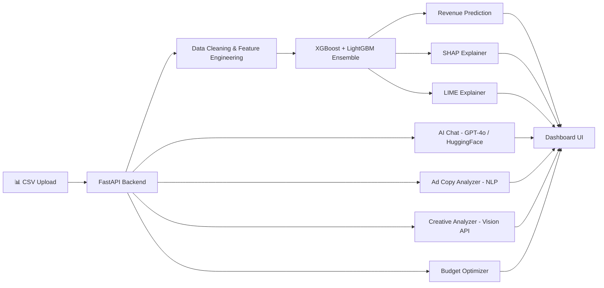

<p align="center">
  
</p>

<h1 align="center">AdPulse — AI-Powered Campaign Intelligence Platform</h1>

<p align="center">
  <strong>ML-driven revenue prediction, explainability (SHAP + LIME), and real-time campaign optimization for digital advertising.</strong>
</p>

<p align="center">
  <a href="#features"></a>
  <a href="#tech-stack"></a>
  <a href="#tech-stack"></a>
  <a href="#tech-stack"></a>
  <a href="LICENSE"></a>
</p>

<p align="center">
  <a href="#-quick-start">Quick Start</a> •
  <a href="#-features">Features</a> •
  <a href="#-architecture">Architecture</a> •
  <a href="#-api-reference">API Reference</a> •
  <a href="#-model-performance">Model Performance</a>
</p>

---

## 🎯 Overview

**AdPulse** is a full-stack campaign intelligence system that combines machine learning, explainable AI, and real-time analytics to help marketing teams predict revenue, understand model decisions, and optimize ad spend across channels.

Built for the **BNY Mellon DataSprint Hackathon**, AdPulse goes beyond simple predictions — it provides *actionable insights* backed by SHAP/LIME explanations, budget optimization, and AI-powered campaign analysis.

### What Makes AdPulse Different?

| Traditional Analytics | AdPulse |
|---|---|
| Backward-looking reports | **Predictive revenue forecasting** |
| Black-box models | **SHAP + LIME explainability** |
| Manual budget allocation | **ROAS-weighted auto-optimization** |
| Static dashboards | **Real-time interactive intelligence** |
| No risk detection | **ML-powered anomaly alerts** |

---

## ✨ Features

### 📊 Analytics & Prediction
- **Revenue Prediction Engine** — XGBoost + LightGBM ensemble with R² = 0.993 accuracy
- **Spend Sensitivity Analysis** — Revenue impact curves across ±50% spend scenarios
- **Campaign Health Scoring** — Composite metric combining intent, quality, and efficiency
- **Risk Detection** — Automatic flagging of underperforming campaigns

### 🧠 Explainable AI (XAI)
- **SHAP Global Explanations** — Top revenue drivers ranked by impact magnitude
- **SHAP Dependence Plots** — Visualize how individual features influence predictions
- **LIME Local Explanations** — Instance-level model explanations for any campaign
- **Business Insight Narratives** — Auto-generated human-readable recommendations

### 🤖 AI-Powered Tools
- **Campaign Chat Analyst** — GPT-4o-mini / HuggingFace / rule-based fallback
- **Ad Copy Analyzer** — Sentiment analysis + engagement prediction via HuggingFace NLP
- **Creative Analyzer** — Image quality scoring via Google Cloud Vision API
- **Budget Optimizer** — ROAS-weighted allocation across channels

### 📈 Dashboard
- **10+ interactive pages** — Overview, Campaigns, Predict, Explainability, AI Tools, Budget, Segments, Reports, Alerts
- **Dark/Light theme** — Toggle between sleek dark mode and clean light mode
- **Responsive design** — Works on desktop and mobile
- **Real-time data** — Live connection to FastAPI backend
- **Conversion funnel** — Visual funnel from impressions → clicks → conversions → revenue

---

## 🏗️ Architecture

```
AdPulse/
├── backend/
│   ├── main.py              # FastAPI server (610 lines, 15+ endpoints)
│   ├── .env.example          # API key template
│   └── AdPulse-DataSprint/   # Backend sub-module
│
├── frontend/
│   └── dashboard.html        # Single-page dashboard (1447 lines)
│
├── notebook/
│   ├── DataSprint_WinningNotebook.ipynb   # Original Jupyter notebook
│   └── datasprint_complete_notebook.py    # Python script version
│
├── artifacts/                # Pre-trained ML models & data
│   ├── best_xgb.joblib       # Tuned XGBoost model
│   ├── best_lgb.joblib       # Tuned LightGBM model
│   ├── shap_explainer.joblib  # SHAP TreeExplainer
│   ├── lime_config.joblib     # LIME configuration
│   ├── feature_columns.joblib # Feature column list
│   ├── model_metrics.joblib   # Evaluation metrics
│   ├── shap_data.joblib       # Pre-computed SHAP values
│   ├── cluster_model.joblib   # KMeans campaign clusters
│   ├── model_meta.json        # Model metadata
│   └── df_clean_full_with_features.csv  # Processed dataset
│
├── digital_media_dataset.csv  # Raw dataset (3000+ campaigns)
├── requirements.txt           # Python dependencies
├── LICENSE                    # MIT License
└── README.md                 # This file
```

### System Flow



---

## 🚀 Quick Start

### Prerequisites

- **Python 3.9+**
- **pip** (Python package manager)

### 1. Clone the Repository

```bash
git clone https://github.com/YOUR_USERNAME/AdPulse.git
cd AdPulse
```

### 2. Install Dependencies

```bash
# Create virtual environment (recommended)
python -m venv .venv

# Activate it
# Windows:
.venv\Scripts\activate
# macOS/Linux:
source .venv/bin/activate

# Install packages
pip install -r requirements.txt
```

### 3. Configure API Keys (Optional)

```bash
# Copy the example env file
cp backend/.env.example backend/.env

# Edit with your keys (optional — the app works without them)
# - OPENAI_API_KEY    → for GPT-4o-mini chat
# - HF_TOKEN          → for HuggingFace NLP models
# - GOOGLE_APPLICATION_CREDENTIALS → for Vision API
```

> **Note:** AdPulse works fully without API keys. AI features gracefully fall back to rule-based responses.

### 4. Start the Server

```bash
cd backend
uvicorn main:app --reload --port 8000
```

### 5. Open the Dashboard

Navigate to **[http://localhost:8000](http://localhost:8000)** in your browser.

### 6. Upload Data

Go to the **Upload Data** page and upload `digital_media_dataset.csv` to load campaign data.

---

## 📡 API Reference

| Method | Endpoint | Description |
|--------|----------|-------------|
| `GET` | `/api/health` | Server health check + model status |
| `POST` | `/api/upload` | Upload campaign CSV for processing |
| `GET` | `/api/campaigns` | Retrieve all campaigns with metrics |
| `GET` | `/api/campaigns/summary` | Aggregated KPI summary |
| `POST` | `/api/predict` | Predict revenue for given parameters |
| `GET` | `/api/shap/global` | SHAP global feature importance |
| `POST` | `/api/chat` | AI campaign analyst (multi-provider) |
| `POST` | `/api/analyze-copy` | NLP ad copy sentiment analysis |
| `POST` | `/api/analyze-creative` | Image quality scoring (Vision API) |
| `POST` | `/api/optimize-budget` | ROAS-weighted budget allocation |
| `GET` | `/api/report/csv` | Download campaign report as CSV |
| `GET` | `/api/report/company` | Generate JSON executive report |
| `GET` | `/api/model/info` | Model metadata and metrics |

---

## 📊 Model Performance

### Ensemble Results (Test Set)

| Model | R² Score | RMSE | MAE | MAPE |
|-------|----------|------|-----|------|
| **XGBoost** | 0.9852 | $1,893 | $941 | 11.34% |
| **LightGBM** | 0.9977 | $749 | $378 | 4.53% |
| **Ensemble (55/45)** | **0.9933** | **$1,272** | **$618** | **6.02%** |

### Hyperparameter Tuning

- **Optimizer:** Optuna TPE Sampler
- **XGBoost:** 80 trials
- **LightGBM:** 60 trials
- **Cross-validation:** 5-fold stratified

### Top Revenue Drivers (SHAP)

| Rank | Feature | Avg \|SHAP\| | Direction |
|------|---------|-------------|-----------|
| 1 | `spend_efficiency` | 0.412 | ↑ Revenue |
| 2 | `conversions` | 0.338 | ↑ Revenue |
| 3 | `clicks` | 0.291 | ↑ Revenue |
| 4 | `funnel_velocity` | 0.254 | ↑ Revenue |
| 5 | `conversion_rate_pct` | 0.219 | ↑ Revenue |

---

## 🛠️ Tech Stack

| Layer | Technology |
|-------|-----------|
| **Backend** | FastAPI, Uvicorn, Python 3.9+ |
| **ML Models** | XGBoost, LightGBM, scikit-learn |
| **Explainability** | SHAP (TreeExplainer), LIME (TabularExplainer) |
| **Clustering** | KMeans (k=4), StandardScaler |
| **Tuning** | Optuna (TPE Sampler) |
| **AI Chat** | OpenAI GPT-4o-mini, HuggingFace Mistral-7B |
| **NLP** | HuggingFace (RoBERTa Sentiment, BART-MNLI) |
| **Vision** | Google Cloud Vision API |
| **Frontend** | Vanilla HTML/CSS/JS, Canvas API |
| **Data** | Pandas, NumPy |

---

## 🔧 Development

### Running in Development Mode

```bash
cd backend
uvicorn main:app --reload --port 8000 --log-level info
```

### Re-training Models

To retrain models from scratch, run the notebook:

```bash
cd notebook
python datasprint_complete_notebook.py
```

This will regenerate all artifacts in the `artifacts/` directory.

### API Documentation

FastAPI provides automatic interactive API docs:
- **Swagger UI:** [http://localhost:8000/docs](http://localhost:8000/docs)
- **ReDoc:** [http://localhost:8000/redoc](http://localhost:8000/redoc)

---

## 📂 Dataset

The project uses a digital media advertising dataset with **3,000+ campaigns** across:

- **6 Channels:** Search, Social Media, Display, Email, Video, Affiliate
- **4 Regions:** North America, Europe, Asia-Pacific, Latin America  
- **3 Device Types:** Mobile, Desktop, Tablet
- **40+ Features** after engineering (log transforms, ratios, interaction terms)

---

## 🤝 Contributing

Contributions are welcome! Please feel free to submit a Pull Request.

1. Fork the repository
2. Create your feature branch (`git checkout -b feature/AmazingFeature`)
3. Commit your changes (`git commit -m 'Add AmazingFeature'`)
4. Push to the branch (`git push origin feature/AmazingFeature`)
5. Open a Pull Request

---

## 📄 License

This project is licensed under the MIT License — see the [LICENSE](LICENSE) file for details.

---

## 👤 Author

**Purushottam**  
Built for the BNY Mellon DataSprint Hackathon

---

<p align="center">
  <sub>Built with ❤️ and a lot of ☕</sub>
</p>
